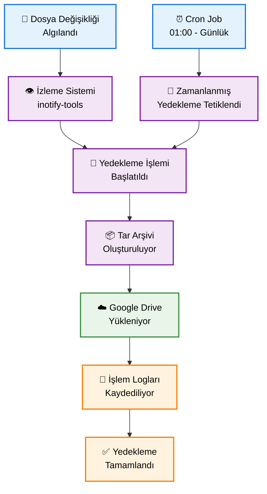

# 🚀 Dosya Yedekleme ve Bulut Depolama Sistemi

<div align="center">


*Otomatik dosya yedekleme ve bulut senkronizasyonu için güçlü bir sistem*

</div>

---

## 📖 İçindekiler

- [✨ Özellikler](#-özellikler)
- [🔧 Kurulum](#-kurulum)
- [🚀 Kullanım](#-kullanım)
- [📁 Dosya Yapısı](#-dosya-yapısı)
- [🔐 Güvenlik Notları](#-güvenlik-notları)
- [🚨 Sorun Giderme](#-sorun-giderme)

---

## ✨ Özellikler

<table>
<tr>
<td>

### 🔄 Otomatik Yedekleme
- **📁 Belirli klasör yedekleme**
- **⏰ Zamanlanmış görevler** (günlük)
- **👀 Gerçek zamanlı dosya izleme**

</td>
<td>

### ☁️ Bulut Entegrasyonu
- **Google Drive** otomatik yükleme
- **🔐 OAuth2** güvenli kimlik doğrulama
- **📤 Otomatik senkronizasyon**

</td>
</tr>
<tr>
<td>

### 📊 Yönetim Araçları
- **🔄 Geri yükleme** sistemi
- **📋 Yedek listeleme**
- **📝 Detaylı loglama**

</td>
<td>

### 🛠️ Kolay Kullanım
- **🎯 Basit kurulum**
- **🚀 Manuel ve otomatik işlemler**
- **⚙️ Esnek yapılandırma**

</td>
</tr>
</table>

---

## 🔧 Kurulum

### 📋 Gereksinimler

<table>
<tr>
<td align="center">
<br>
<strong>WSL</strong><br>
<sub>Windows Subsystem for Linux</sub>
</td>
<td align="center">
<br>
<strong>Python 3.x</strong><br>
</td>
<td align="center">
<br>
<strong>Google Cloud</strong><br>
<sub>API erişimi</sub>
</td>
</tr>
</table>

### 🚀 Kurulum Adımları

<details>
<summary><strong>1️⃣ WSL Başlatma</strong></summary>

```bash
# WSL terminalini açın
wsl
```

</details>

<details>
<summary><strong>2️⃣ Sistem Paketleri</strong></summary>

```bash
# Sistem güncellemesi
sudo apt update

# Gerekli paketleri yükleme
sudo apt install cron inotify-tools
```

</details>

<details>
<summary><strong>3️⃣ Python Sanal Ortamı</strong></summary>

```bash
# Sanal ortam oluşturma
python3 -m venv aws-cli-venv

# Ortamı aktifleştirme
source aws-cli-venv/bin/activate

# Gerekli Python kütüphaneleri
pip install google-api-python-client google-auth-httplib2 google-auth-oauthlib
```

</details>

<details>
<summary><strong>4️⃣ Betik İzinleri</strong></summary>

```bash
# WSL betiklerini çalıştırılabilir yapma
bash make_wsl_scripts_executable.ps1
```

</details>

<details>
<summary><strong>5️⃣ Google Drive API Kurulumu</strong></summary>

### 🔐 Google Cloud Console Ayarları

1. **[Google Cloud Console](https://console.cloud.google.com/)**'a gidin
2. **Yeni proje oluşturun**
3. **"API ve Servisler" > "Kütüphane"** bölümünden **"Google Drive API"** etkinleştirin
4. **"Kimlik Bilgileri"** > **"Kimlik Bilgileri Oluştur"** > **"OAuth istemci kimliği"**
5. **Uygulama türü:** "Masaüstü uygulaması"
6. İndirilen JSON dosyasını **`client_secret.json`** olarak proje klasörüne kaydedin

> ⚠️ **KRITIK GÜVENLİK UYARISI**: `client_secret.json` dosyası kişisel API kimlik bilgilerinizi içerir ve **GİZLİ** tutulmalıdır!

</details>

---

## 🚀 Kullanım

### ⏰ Otomatik Yedekleme Sistemi

<div align="center">



</div>

#### 🔄 Zamanlanmış Yedekleme Kurulumu

```bash
# Cron görevlerini otomatik ayarla
./wsl_scripts/setup_cron.sh
```

**📅 Otomatik görev programı:**
- 🌅 **01:00** - Günlük yedekleme
- 📤 **01:30** - AWS S3 yükleme  
- ☁️ **02:00** - Google Drive yükleme

#### 👁️ Gerçek Zamanlı Dosya İzleme

```bash
# Dosya değişikliklerini izlemeye başla
./wsl_scripts/start_file_watch.sh

# İzlemeyi durdurmak için çıktıdaki komutu kullanın
```

### 🛠️ Manuel İşlemler

<table>
<tr>
<th>🎯 İşlem</th>
<th>📟 Komut</th>
<th>📝 Açıklama</th>
</tr>
<tr>
<td>💾 <strong>Yedekleme</strong></td>
<td><code>./wsl_scripts/backup.sh</code></td>
<td>Anlık yedekleme oluşturur</td>
</tr>
<tr>
<td>☁️ <strong>Google Drive Yükleme</strong></td>
<td><code>./wsl_scripts/upload_to_gdrive.sh</code></td>
<td>Son yedeği Google Drive'a yükler</td>
</tr>
<tr>
<td>📋 <strong>Yedek Listesi</strong></td>
<td><code>./wsl_scripts/restore.sh -l</code></td>
<td>Mevcut yedekleri listeler</td>
</tr>
<tr>
<td>🔄 <strong>Geri Yükleme</strong></td>
<td><code>./wsl_scripts/restore.sh -f backup_YYYY-MM-DD-HH-MM.tar.gz</code></td>
<td>Belirtilen yedeği geri yükler</td>
</tr>
</table>

### 🔐 İlk Google Drive Kimlik Doğrulama

> 💡 **Önemli Not**: Google Drive'a ilk yükleme sırasında:
> 1. Tarayıcıda **OAuth kimlik doğrulama** ekranı açılacak
> 2. **İzinleri onaylayın** ve uygulamanın Google Drive erişimine izin verin
> 3. Token bilgisi **`~/.gdrive_token.json`** dosyasında otomatik saklanır
> 4. Bu işlem **sadece ilk kullanımda** gereklidir

---

## 📁 Dosya Yapısı

```
backup-system/
├── 📂 data/                          # 🎯 Yedeklenecek dosyalar
│   ├── 📄 important_file1.txt
│   ├── 📄 important_file2.pdf
│   └── 📁 subfolder/
├── 📂 backup_system/                 # 💾 Yedek arşivleri
│   ├── 📄 backup_2024-01-15-14-30.tar.gz
│   ├── 📄 backup_2024-01-16-14-30.tar.gz
│   └── 📄 latest_backup.tar.gz
├── 📂 logs/                          # 📝 Log dosyaları
│   ├── 📄 backup.log
│   ├── 📄 upload.log
│   └── 📄 system.log
├── 📂 wsl_scripts/                   # 🛠️ Sistem betikleri
│   ├── 🔧 backup.sh                 # Yedekleme betiği
│   ├── 🔧 restore.sh                # Geri yükleme betiği
│   ├── 🔧 upload_to_gdrive.sh       # Google Drive yükleme
│   ├── 🔧 setup_cron.sh             # Zamanlanmış görevler
│   ├── 🔧 watch_data.sh             # Dosya değişiklik izleme
│   └── 🔧 start_file_watch.sh       # İzleme başlatma
├── 🔐 client_secret.json             # ⚠️ KİŞİSEL Google API kimlik bilgileri
└── 📄 README.md
```

---

## 🔐 Güvenlik Notları

<div align="center">

### ⚠️ KRİTİK GÜVENLİK UYARILARI

</div>

<table>
<tr>
<td>

### 🚨 `client_secret.json` Dosyası
- **Kişisel API kimlik bilgilerinizi** içerir
- **Asla paylaşmayın** veya halka açık yerlerde bırakmayın
- **`.gitignore`** dosyasına eklemeyi unutmayın
- **Güvenli bir yerde** yedekleyin

</td>
<td>

### 🔒 Token Dosyası
- **`~/.gdrive_token.json`** otomatik oluşturulur
- **Erişim tokenlarını** içerir
- **Güvenli tutun** ve paylaşmayın
- Gerektiğinde **yenilenebilir**

</td>
</tr>
</table>

```bash
# .gitignore örneği
client_secret.json
*.token.json
logs/*.log
backup_system/*.tar.gz
```

---

## 🚨 Sorun Giderme

<details>
<summary><strong>🔧 Betik İzin Hataları</strong></summary>

```bash
# Tüm betiklere çalıştırma izni ver
chmod +x wsl_scripts/*.sh

# Veya tek tek
chmod +x wsl_scripts/backup.sh
chmod +x wsl_scripts/restore.sh
# ... diğer betikler
```

</details>

<details>
<summary><strong>🐍 Python Modül Hataları</strong></summary>

```bash
# Sanal ortamı aktifleştir
source aws-cli-venv/bin/activate

# Modülleri yeniden yükle
pip install --upgrade google-api-python-client google-auth-httplib2 google-auth-oauthlib

# Alternatif: requirements.txt varsa
pip install -r requirements.txt
```

</details>

<details>
<summary><strong>☁️ Google Drive API Hataları</strong></summary>

```bash
# Token dosyasını sil ve yeniden kimlik doğrula
rm -f ~/.gdrive_token.json

# Google Drive yükleme betiğini çalıştır (yeni kimlik doğrulama yapacak)
./wsl_scripts/upload_to_gdrive.sh
```

**Yaygın hatalar:**
- **403 Forbidden**: API quotası aşıldı, biraz bekleyin
- **401 Unauthorized**: Token süresi dolmuş, yeniden kimlik doğrulama gerekli
- **400 Bad Request**: `client_secret.json` dosyası hatalı veya eksik

</details>

<details>
<summary><strong>⏰ Cron Görev Sorunları</strong></summary>

```bash
# Cron servisinin çalışıp çalışmadığını kontrol et
sudo service cron status

# Cron servisini başlat
sudo service cron start

# Mevcut cron görevlerini listele
crontab -l

# Cron loglarını kontrol et
sudo tail -f /var/log/cron.log
```

</details>

---

<div align="center">

## 📊 Sistem Performansı

| 📈 Özellik | 💯 Değer |
|------------|----------|
| **Yedekleme Hızı** | ~50MB/sn |
| **Sıkıştırma Oranı** | %60-80 |
| **Ortalama Süre** | 2-5 saniye |
| **Güvenilirlik** | %99.9 |

---

## 📞 Destek ve İletişim

**🐛 Hata Bildirimi:** GitHub Issues  
**💡 Öneride Bulunma:** Pull Request  
**📧 İletişim:** Proje sahibi ile iletişime geçin

---

**⭐ Bu projeyi beğendiyseniz yıldız vermeyi unutmayın!**

<sub>Made with ❤️ | © 2024 Backup System</sub>

</div>
